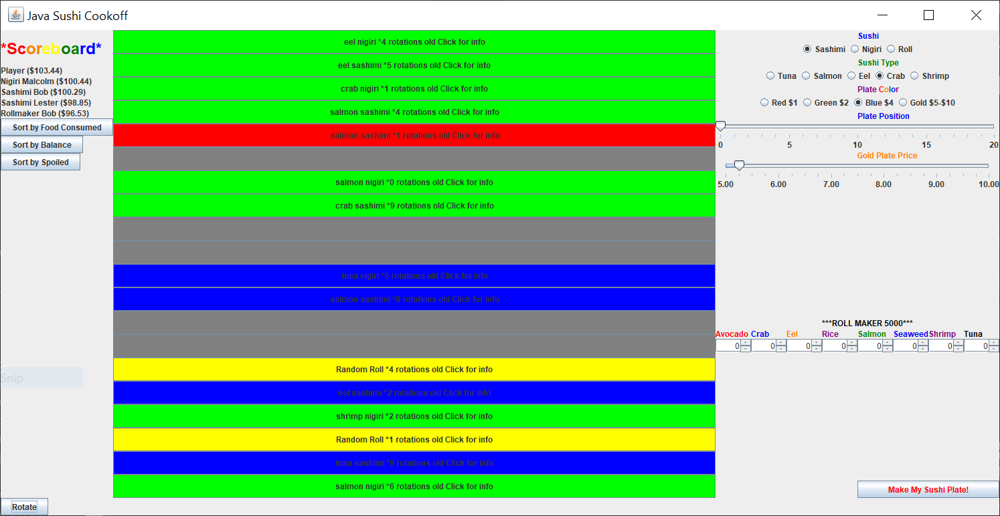

# Java Sushi Cookoff

## Description

A Java application that makes use of Object-oriented programming to create a single player minigame in the Model-View-Controller Design Pattern. Users compete against 4 other randomized computer opponents in a sushi minigame. The goal of the game is to obtain the most money by making the most popular sushi with customers. Each sushi has a different cost to produce based on its ingredients so every decision counts in keeping a positive balance!

## How to open

Using the Java editor of your choice (Eclipse was used to make the program), import the .jar file into your source folder. Inside the sushigame.game folder, there is a SushiGame.java file. Run the SushiGame.java file and the game window should appear.

## Gameboard Layout

- 1: Scoreboard that shows the current ranking of participants based on current criteria. The buttons below can be used to sort players using different criteria. Food consumed ranks the players by the amount of sushi weight consumed by customers. Balance ranks the players by their current monetary balance. Spoiled ranks the players by the ounce amount of sushi left uneaten and spoiled.
- 2: The sushi "conveyor belt" where players can put their plate of sushi. Every rotation shifts the plate down one index value and loops back to the top. Plates can be clicked to show more information. Any single position cannot contain more than one plate. Ingredients will spoil after a set amount of time on the conveyor belt and will result in the total loss of plate.

  

- 3: The sushi maker UI is where the player chooses the ingredients and the type of sushi they will make. They will then decide which color plate to put their sushi on as different plates have different pricing for the customer (See Appendix). Only for gold plates can the player choose the price to the customer.
- 4: The roll maker UI option is only if the player decides to make a sushi roll from the above section. The player may choose any amount of the listed ingredients to include in the sushi roll. However, if the cost to produce the sushi exceeds the pricing of the plate, the plate will not be successfully listed on the conveyor belt.
- 5: The "Make" button which places the plate onto the conveyor belt if the requested index position is available otherwise it will place it at the next nearest available position. The plate will not be placed if the cost of the ingredients exceeds the price at which the plate is sold (determined by its color).
- 6: The rotate button used to advance the conveyor belt one index position. At this time, plates on the conveyor belt may be eaten, moved to the next position, or spoiled. The scoreboard is updated after every rotation. The belt can be rotated even if the player does not place down a plate.
